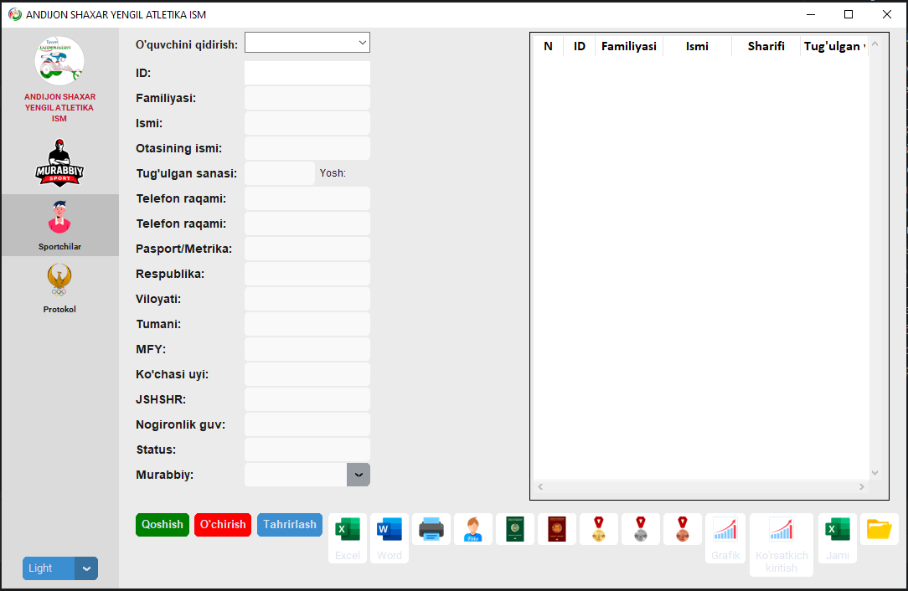

# 🏫 Программа для спортивной школы

  

## 📌 Описание проекта
Десктопное приложение для ведения базы данных учащихся-спортсменов с инвалидностью в паралимпийской школе (Узбекистан).

Программа предназначена для упрощения работы тренеров, хранения информации об учениках и формирования отчётов для соревнований.

---

## ⚙️ Основные возможности

- Хранение данных о тренерах и учениках  
- Привязка учеников к тренерам  
- Удобный интерфейс для работы с данными  
- Автоматическое формирование отчётов  
- Подготовка документов для печати и подписи жюри  

---

## 🪟 Структура программы

### 1. Окно тренеров
Содержит:
- список тренеров  
- персональные данные тренеров  
- привязку тренеров к ученикам  

---

### 2. Окно учеников
Содержит:
- полную информацию об учениках-спортсменах  
  - ФИО  
  - возраст  
  - категория  
  - достижения  
  - вид спорта  

---

### 3. Окно отчётов
Предназначено для:
- формирования таблиц в день соревнований  
- подготовки документов для печати  
- подписания жюри  

📊 Все отчёты формируются на основе единой базы данных, содержащей информацию обо всех спортсменах-паралимпийцах республики.

---

## 🧱 Технологии (пример)

- Python  
- Tkinter / CustomTkinter (GUI)  
- SQLite / PostgreSQL (база данных)  
- Pandas (обработка данных)  
- OpenPyXL / ReportLab (экспорт в Excel / PDF)  

---

## 🚀 Планы по развитию

- Авторизация пользователей (администратор / тренер)  
- Фильтрация данных (по региону, категории, виду спорта)  
- Экспорт отчётов в Excel и PDF  
- Интеграция с онлайн-базами данных  
- Улучшение интерфейса  

---

## 📌 Назначение
Программа разработана для цифровизации процессов в паралимпийских школах и повышения эффективности работы тренеров и администрации.

