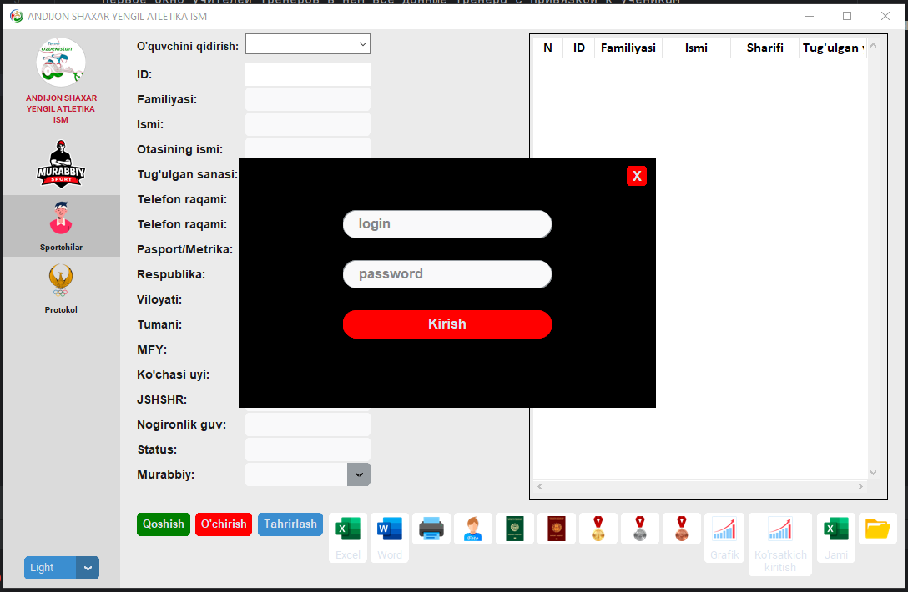
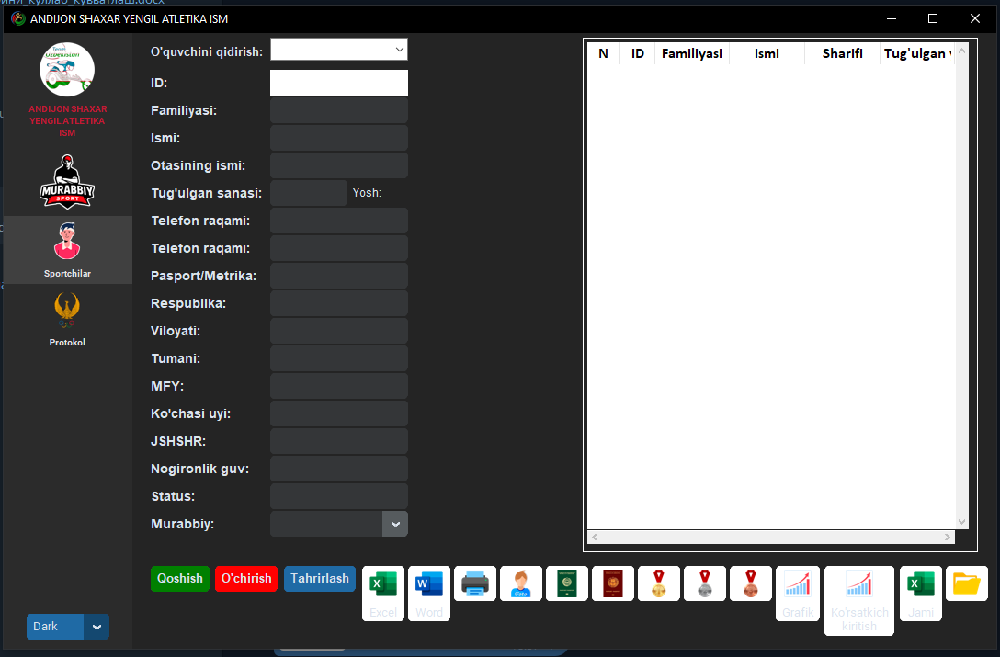
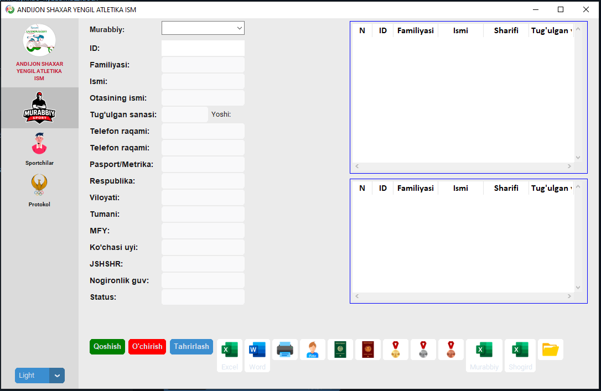

# 🏫 Adaptive Sports Management System

------------------------------------------------------------------------

## 📌 Overview

**Adaptive Sports Management System** is a desktop application designed
for managing student-athletes with disabilities in Paralympic schools.

It helps coaches and administrators efficiently manage athlete data,
track progress, and generate competition-ready reports.

------------------------------------------------------------------------

## ✨ Features

-   👨‍🏫 Coach management (profiles, assignments)
-   🧑‍🦽 Athlete database with detailed profiles
-   🔗 Linking athletes to coaches
-   📊 Automated report generation
-   🖨️ Printable documents for competitions and jury
-   💾 Centralized database system

------------------------------------------------------------------------

## 🪟 Application Modules

### 👨‍🏫 Coaches Module

-   List of coaches
-   Personal information
-   Athlete assignments

### 🧑‍🦽 Athletes Module

-   Full athlete profiles:
    -   Full Name
    -   Age
    -   Category
    -   Achievements
    -   Sport Type

### 📊 Reports Module

-   Generate competition tables
-   Prepare printable documents
-   Jury signing support

------------------------------------------------------------------------

## 🧱 Tech Stack

-   **Python 3.11**
-   **CustomTkinter / Tkinter** (GUI)
-   **SQLite / PostgreSQL** (Database)
-   **Pandas** (Data processing)
-   **OpenPyXL / ReportLab** (Excel / PDF export)

------------------------------------------------------------------------

## 📂 Project Structure

    project/
    │── main.py
    │── ui/
    │── database/
    │── reports/
    │── assets/
    │── images/
    └── README.md

------------------------------------------------------------------------

## 🚀 Roadmap

-   🔐 Authentication system (Admin / Coach roles)
-   🔎 Advanced filtering (region, category, sport)
-   📤 Export to Excel / PDF
-   ☁️ Cloud database integration
-   🎨 UI/UX improvements

------------------------------------------------------------------------

## 📸 Screenshots

`{=html}

`{=html}

`{=html}

`{=html}

------------------------------------------------------------------------

## 🎯 Purpose

This system aims to **digitize sports school processes** and improve
efficiency in managing Paralympic athletes and competitions.

------------------------------------------------------------------------

## 📜 License

This project is licensed under the MIT License.

------------------------------------------------------------------------

## 🤝 Contributing

Contributions are welcome! Feel free to fork the project and submit a
pull request.

------------------------------------------------------------------------

## ⭐ Support

If you like this project, give it a ⭐ on GitHub!
